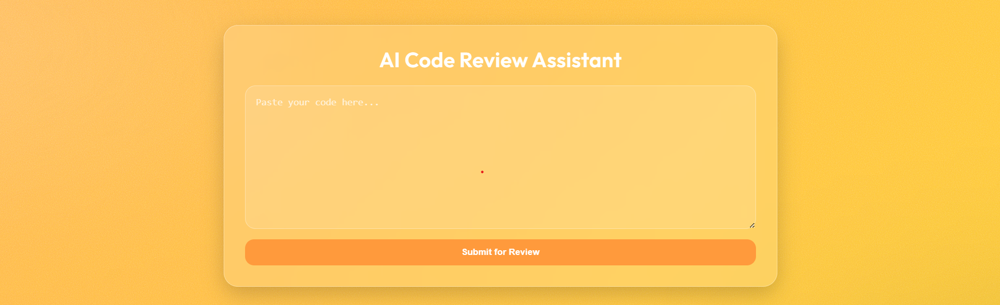

# 🤖 AI Code Reviewer

A lightweight AI-powered website that provides free code reviews.  
Paste code into the web UI and the server forwards it to the Groq LLM to generate concise, structured feedback.

---

## 🔎 Project structure:
ai-code-reviewer/
├── app.py # Flask backend
├── templates/
│ └── index.html # Frontend (your HTML file)
├── .env # local only - contains GROQ_API_KEY (gitignored)
├── .env.example # template for contributors
├── .gitignore
├── requirements.txt
└── README.md

---

## 🛠️ Requirements
- Python 3.10+ recommended
- Pip

`requirements.txt`:
Flask>=2.0
python-dotenv>=0.21
groq == 0.31.0

# Create & activate virtual environment
python -m venv venv
# macOS / Linux
source venv/bin/activate
# Windows PowerShell
venv\Scripts\Activate.ps1

# Install dependencies
pip install -r requirements.txt

Create a .env file in project root and add your Groq API key:
GROQ_API_KEY=your_groq_api_key_here

Run the app:
python app.py

--------------------------------

🔁 How the flow works

User pastes code in templates/index.html UI and clicks Submit for Review.

Browser sends a POST /review with JSON { "code": "..." }.

Flask endpoint review() forms a chat-style request and calls the Groq client:

Model: llama-3.3-70b-versatile (adjustable)

System prompt instructs the model to act as a concise code reviewer

API response parsed and returned as JSON { "feedback": "..." } to UI, which displays it.

-----------------------------------

🧪 Example curl request (test endpoint)
curl -X POST http://127.0.0.1:5000/review \
  -H "Content-Type: application/json" \
  -d '{"code": "def add(a,b):\n    return a+b\n"}'

Expected JSON response:
  {
  "feedback": "✅ Function works. Consider adding type hints, spacing around +, and a docstring: def add(a: int, b: int) -> int: ...\nSuggestions: ..."
}

-------------------------------------

🔧 Customization & tips

Change model / params
In app.py adjust model, temperature, max_tokens depending on desired verbosity/accuracy.

Token limits
Be mindful of request/response token limits for your chosen model. If long code is rejected, chunk input or summarize before sending.

UI polish
The current index.html is a single-file UI using render_template('index.html'). If you move CSS/JS to static/, update template paths accordingly.

Rate limits & error handling
Monitor Groq usage/quotas. Consider adding retries, exponential backoff, or usage logging in production.

---------------------------------------

🐞 Troubleshooting

API KEY LOADED: False printed – make sure .env exists and contains GROQ_API_KEY. Check file encoding and that load_dotenv() is called before reading.

Model/SDK errors – check Groq SDK docs for the correct client usage and the package name/version in requirements.txt.

500 server errors – view Flask console logs (you already print errors in app.py) to inspect exceptions.

----------------------------------------

🤝 Contributing

PRs welcome — please:

Fork the repo

Create a feature branch: git checkout -b feat/your-change

Open a PR with a short description of the change

